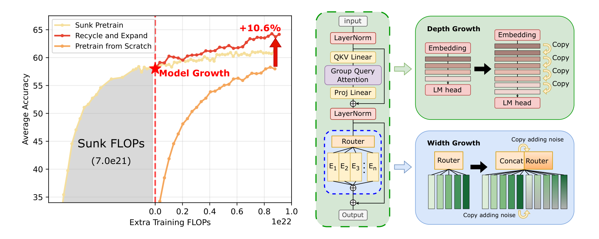
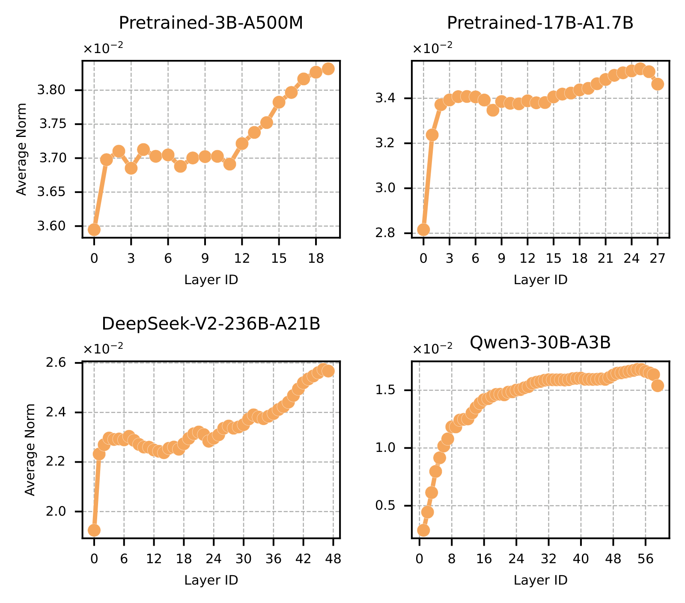
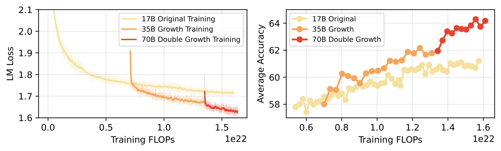
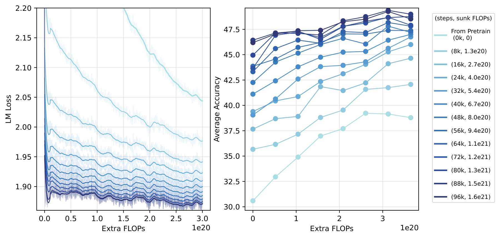

# 🌱 Orthogonal Model Growth

[](https://icml.cc/)
[](https://arxiv.org/abs/2510.08008)
[](LICENSE)
[](growth/)

Project page + unofficial reference implementation for the ICML 2026 paper
**"Beyond Sunk Costs: Boosting LLM Pre-training Efficiency via Orthogonal
Growth of Mixture-of-Experts"**
([arXiv:2510.08008](https://arxiv.org/abs/2510.08008)).

<p align="center">
  
</p>

> Left: training-efficiency gain vs. from-scratch under matched extra FLOPs.
> Right: the two orthogonal growth axes — depth via layer copying, width via
> noisy expert duplication.


## ⚡ TL;DR

- 💰 Pre-trained checkpoints carry a large **sunk cost** that is normally
  discarded — we recycle it by *growing* the model instead of restarting.
- ➕ For converged MoE models, two orthogonal growth operators suffice:
  **interposition** depth growth and **noisy expert duplication** width
  growth.
- 🚀 Scaling a 17B → 70B MoE on 1T tokens, recycling yields a **10.6%**
  average downstream-accuracy gain over training-from-scratch under the
  same *extra* FLOPs budget.

## 🧪 Method

**Depth growth (Section 3.1).** Given a converged model with layers
`l_1, …, l_n`, the standard "stacking" baseline concatenates the whole
block `k` times. We instead use *interposition* — duplicate each layer
in place:

```
stack:         l1 l2 ... ln  l1 l2 ... ln  ...
interposition: l1 l1 ... l1  l2 l2 ... l2  ...
```

Why interposition wins on converged models: well-trained LLMs develop a
characteristic layer-wise weight-norm profile (small and noisy near
embeddings, monotonically increasing through the middle, slightly
dipping near the head). Stacking shatters this profile at the seam
between the last copied block and the first repeated one; interposition
preserves it. We observe the same pattern across our own checkpoints
and several open-source models.

<p align="center">
  
</p>

The empirical *boundary* at which interposition starts to outperform
stacking is at **~1×** the Chinchilla-optimal compute (`F_c ≈ 6·N_a·20·N_a`,
counting activated parameters for MoE). Past that point, the norm
profile has stabilised and disrupting it costs additional training to
repair.

**Width growth (Section 3.2).** Double `E` and `top_k` simultaneously,
copy the experts and router weights, then add a tiny Gaussian
perturbation to the copies to break symmetry:

```
ε ~ N(0, (α · σ_orig)²)    with α = 0.01
```

The perturbation is critical — without it the duplicated experts
receive identical router gradients and never specialise. Pure
duplication (`α = 0`) matches loss but loses ≈1 pt downstream;
re-initialising the experts from scratch (the upcycling-style baseline)
is dramatically worse, confirming that the win comes from knowledge
inheritance, not symmetry breaking alone.

**Orthogonality.** Depth and width are mutually orthogonal: the final
model is invariant to the order of the two operators, and the Adam
first-moment cosine between the pre-growth model and either grown
variant stays `|cos| < 0.04` throughout continued training. This is what
lets us compose them in the 17B → 35B → 70B chain without re-tuning.

## 📊 Key results

**17B → 35B (depth) → 70B (width), 1T tokens.** The grown 70B beats the
17B base by **+5.62** acc points, the 35B intermediate by **+2.21**, and
a from-scratch 70B under matched *extra* FLOPs by **+6.18** (= 10.6%
relative).

<p align="center">
  
</p>

**Sunk cost matters.** At a fixed extra budget, final accuracy is
strongly positively correlated with the sunk cost of the base
checkpoint — i.e. later, more-converged checkpoints make better growth
bases.

<p align="center">
  
</p>

| Base step | 0k | 8k | 16k | 24k | 32k | 40k | 48k | 56k | 64k | 72k | 80k | 88k | 96k |
|---|---|---|---|---|---|---|---|---|---|---|---|---|---|
| End acc | 38.79 | 42.07 | 44.65 | 46.00 | 46.75 | 47.00 | 47.20 | 47.37 | 47.81 | 47.90 | 48.76 | 48.99 | 48.52 |
| Avg acc | 36.29 | 39.09 | 41.19 | 42.69 | 43.34 | 44.51 | 45.67 | 46.15 | 46.49 | 47.13 | 47.43 | 47.88 | 47.82 |

> Continued-training budget: `3×10²⁰` FLOPs on each grown 6B model
> (Section 4.1, Table 2 in the paper).

## 📁 Repository layout

```
Orthogonal-Model-Growth/
├── README.md                          ← you are here
├── LICENSE
├── CITATION.cff
├── assets/                            ← figures used in this page
├── growth/                            ← reference algorithm
│   ├── README.md
│   ├── algorithm.py                   ← zero-dep growth on Megatron-style state dicts
│   ├── demo.py                        ← toy 4-layer/4-expert sanity demo
│   └── hf_depth_growth.py             ← HuggingFace-API depth growth (any AutoModelForCausalLM)
├── eval/                              ← grow-then-eval closed loop
│   ├── README.md
│   ├── plain_eval.py                  ← lm-eval-harness wrapper, optional in-memory growth
│   └── run_eval.sh                    ← multi-GPU sweep example
├── analysis/                          ← layer-wise weight-norm analysis (Fig. 2)
│   ├── README.md
│   └── layer_norm.py
└── integration/megatron/              ← the Megatron-LM scripts used in the paper
    ├── README.md
    ├── Offline_checkpoint_growth.py
    └── Launch_offline_checkpoint_growth.sh
```

- **`growth/`** — read this first. `algorithm.py` is ~300 lines of
  plain PyTorch implementing the two growth operators on
  `Dict[str, torch.Tensor]` state dicts, plus a runnable toy demo.
  `hf_depth_growth.py` is the HuggingFace-API variant for off-the-shelf
  MoE checkpoints (DeepSeek, Qwen, Mixtral, ...). Companion docs in
  [`growth/README.md`](growth/README.md).
- **`eval/`** — minimal "grow → eval" loop on public MoE checkpoints.
  Optional `--use-model-growth` applies depth growth in memory before
  running lm-evaluation-harness. See
  [`eval/README.md`](eval/README.md).
- **`analysis/`** — reproduces Figure 2 of the paper: per-layer
  weight-norm profile for any HuggingFace MoE model. See
  [`analysis/README.md`](analysis/README.md).
- **`integration/megatron/`** — the actual scripts we ran on top of
  [microsoft/ltp-megatron-lm](https://github.com/microsoft/ltp-megatron-lm)
  to grow the 17B base checkpoint. Has external dependencies on
  Megatron-LM internals. See
  [`integration/megatron/README.md`](integration/megatron/README.md).

## 🚀 Try it end-to-end on a public MoE checkpoint

```bash
pip install torch transformers lm-eval accelerate

# 1. Inspect the layer-wise norm profile (Fig. 2)
python analysis/layer_norm.py \
    --hf-modeling-path deepseek-ai/DeepSeek-V2-Lite \
    --save-path ./out/dpsk-v2-lite

# 2. Grow it (interleaving, k=2) and persist the new checkpoint
python growth/hf_depth_growth.py \
    --model-name-or-path deepseek-ai/DeepSeek-V2-Lite \
    --output-dir ./hf_grow/dpsk-v2-lite-interleaving \
    --method interleaving --torch-dtype bfloat16

# 3. Evaluate both (in-memory growth is also supported via --use-model-growth)
python eval/plain_eval.py --model deepseek-ai/DeepSeek-V2-Lite \
    --task arc_challenge,boolq,hellaswag,openbookqa,winogrande
python eval/plain_eval.py --model ./hf_grow/dpsk-v2-lite-interleaving \
    --task arc_challenge,boolq,hellaswag,openbookqa,winogrande
```

To just smoke-test the algorithm offline (no model download, no GPU):

```bash
python growth/demo.py
```

Builds a toy 4-layer / 4-expert MoE state dict and runs both depth
growth (interposition and stack, `k=2`) and width growth
(`E=4 → 8`, `α=0.01`) on it.

## 🔬 Reproducing the large-scale runs

> The full pre-training pipeline — data, configs, dispatch scripts —
> cannot be released under our company's compliance review. **This repo
> is an unofficial reproduction guide**: the growth operator is
> open-sourced here, but you bring your own base checkpoint and data.

Recommended path:

1. Use [microsoft/ltp-megatron-lm](https://github.com/microsoft/ltp-megatron-lm)
   to pre-train (or continue training from a public checkpoint of) an
   MoE base model.
2. Drop [`integration/megatron/Offline_checkpoint_growth.py`](integration/megatron/Offline_checkpoint_growth.py)
   and [`Launch_offline_checkpoint_growth.sh`](integration/megatron/Launch_offline_checkpoint_growth.sh)
   into the Megatron root and run the offline growth pass on a saved
   checkpoint. The script writes a new dist-ckpt under
   `${OUTPUT_DIR}/checkpoints/growth_model_<iteration>`.
3. Resume Megatron training with the new checkpoint as `--load`.

Key growth flags (full list in
[`integration/megatron/README.md`](integration/megatron/README.md#key-flags-add_growth_args-in-offline_checkpoint_growthpy)):

| Flag | Purpose |
|------|---------|
| `--do-depth-growth` | Duplicate transformer layers. |
| `--do-moe-width-growth` | Duplicate experts and the router. |
| `--growth-stack-method {interleaved,stacked}` | `interleaved` = interposition (paper Eq. 2). |
| `--growth-ignore-first-num-layers N` / `--growth-ignore-last-num-layers N` | Leave edge layers un-grown (paper uses `N=2`). |
| `--growth-add-expert-noise` + `--growth-expert-noise-std-scaling-factor 0.01` | Symmetry-breaking perturbation for width growth. |

## 📝 Citation

```bibtex
@article{wang2025orthogonal,
  title  = {Beyond Sunk Costs: Boosting {LLM} Pre-training Efficiency
            via Orthogonal Growth of Mixture-of-Experts},
  author = {Wang, Ruizhe and Ding, Yucheng and Liu, Xiao and
            Wang, Yaoxiang and Cheng, Peng and Guo, Baining and
            Zha, Zhengjun and Gong, Yeyun},
  journal= {arXiv preprint arXiv:2510.08008},
  year   = {2025},
  note   = {Accepted at ICML 2026},
  url    = {https://arxiv.org/abs/2510.08008}
}
```

## 🙏 Acknowledgements

The full-scale pre-training and growth runs used Microsoft Research
Asia's compute infrastructure. The public Megatron fork that this
project plugs into is maintained at
[microsoft/ltp-megatron-lm](https://github.com/microsoft/ltp-megatron-lm).

## 📄 License

Code in this repository is released under the [MIT License](LICENSE).
Figures in `assets/` are reproduced from the paper.
